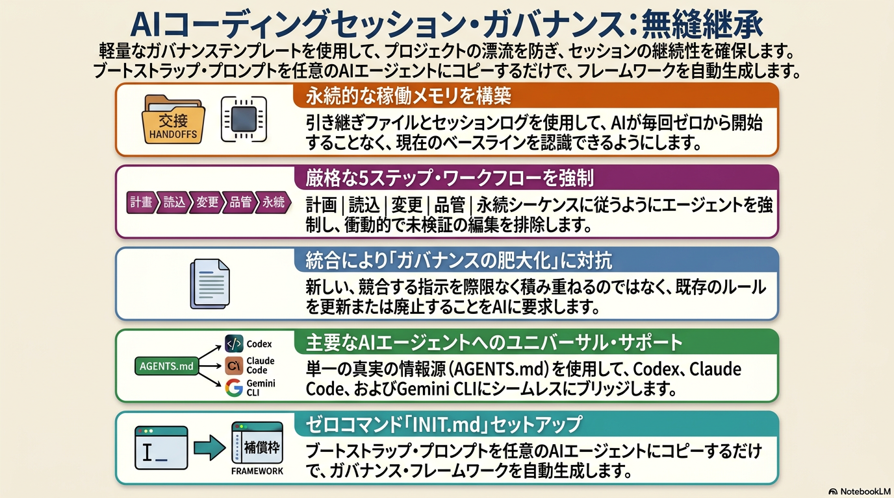

[English](README.md) | [繁體中文](README.zh-TW.md) | [简体中文](README.zh-CN.md) | 日本語

# :rocket: AIツール間の引き継ぎを支える開発ガバナンステンプレート

Codex、Claude、Gemini のトークン配分を使い切ったら、引き継ぎブロックを次のツールに貼り付けるだけ。同じ状態から続けられます。

- 異なるAI CLIツール間で引き継ぎが機能する
- 統一ワークフロー：`PLAN -> READ -> CHANGE -> QC -> PERSIST`
- ルールを増やし続けるのではなく、ガバナンスのドリフトを防ぐ

**[30秒クイックスタート](#quickstart)** · **[インストール](#install)** · **[アップグレード](#upgrade)** · **[クイック操作](#quick-operations)**



---

## :bookmark_tabs: なぜこれが必要か

複数のAIツールを使う開発では、まず壊れるのは引き継ぎで、生成品質ではありません。

よくある失敗パターン：
- ツールを切り替えるたびに最初から説明し直す
- 修正が修正の上に積み重なってルールが煩雑になる
- README・引き継ぎ文書・ログが食い違ってくる

このテンプレートは次の3点を必須にします。
1. セッションごとに単一の再開経路を持つ
2. すべての作業を同じワークフローで進める
3. セッションを閉じる前に追跡可能な記録を残す

---

## :bookmark_tabs: 内蔵セーフガード

よくあるAIの失敗パターンもカバーしています。

| セーフガード | 防止する問題 |
|---|---|
| **外部 API コード安全（§0b）** | 訓練データの記憶からエンドポイント / パラメータ / スキーマを推測して API 呼び出しコードを書くこと |
| **コードベースコンテキストスナップショット** | セッション切り替えのたびに技術スタック・外部サービス・主要決定を再学習すること |
| **テスト計画ガバナンス（§3d）** | シナリオマトリックスなしで変更をマージすること — 期待結果と実績が未記録になること |
| **統合規律（§3b）** | 既存ルールを更新すべきか確認せずに規則を積み上げ続けること |

---

## :bookmark_tabs: 最近のリリース

| バージョン | 変更内容 | あなたへのメリット |
|---|---|---|
| **v1.9.0** | 6つのガバナンス修正：§1 3トリガー新セッション定義、§3 PERSIST 明示的なクロスドキュメント同期、§4 Open Priorities 再生成（replace not append）、§4 max-3 説明、§10 Known Risksへの記録、§5.7 変更操作の精確化 | 実際の運用で発見されたAIの行動ギャップを修正 — 古い優先リスト・文書同期漏れ・スコープの曖昧さ |
| **v1.8.0** | §1にコンテキスト圧縮リカバリルールを追加 — 圧縮後はAIが起動シーケンスを再実行し、サマリーのpending tasksを信頼しない | Claude Codeがセッション途中で自動圧縮した後、AIが古いタスクをそのまま実行するのを防ぐ |
| **v1.7.0** | 引き継ぎPromptの冒頭に明示的な指示を追加：まず `AGENTS.md` を読み、§1シーケンスに従う | 受信ツールがガバナンスファイルを自動ロードしなくても引き継ぎが機能する |
| **v1.6.0** | インストール後にQuick Startブロックを自動出力；`CODEBASE_CONTEXT.md`生成前にバックアップ、スキャン対象を拡大 | インストール直後にコマンドが使える；初回コンテキスト取得がより完全になる |
| **v1.5.0** | External API Code Safety §0b — APIコード記述前に文書検証ベースラインを必須化；PROJECT_MASTER_SPEC §10 の意図ベーストリガー | APIハルシネーションを防止；長期プロジェクトに安定した権威仕様書を提供 |

---

<a id="quickstart"></a>

## :bookmark_tabs: 30秒クイックスタート

1. **[INIT.md](INIT.md)** を開き、AIコマンドラインツールへ貼り付けます。
2. 画面の指示に従い、次の確認文を正確に返します。
   - `INSTALL_ROOT_OK: <absolute_path>`
   - `INSTALL_WRITE_OK`
3. 以後の新規セッション開始時は、次を入力します。

```text
AGENTS.md に従ってこのセッションを開始してください
```

---

<a id="install"></a>

## :bookmark_tabs: インストール

1. **[INIT.md](INIT.md)** を開く -> **Raw** をクリック -> 全選択 -> コピー
2. AIコマンドラインツール（Claude Code、Codex、Gemini CLI のいずれか）へ貼り付ける
3. AIは最初にルート安全性の事前確認を実行し、`pwd` と `git root` をこの順で表示する
4. `pwd` と `git root` が一致しない場合、AIは必ず停止し、使用ルートの選択を求める（自動選択は禁止）
5. AIは書き込み前に、リスク確認と演習計画（`create` / `merge` / `skip`）を表示する
6. 次の確認文を返す
   - `INSTALL_ROOT_OK: <absolute_path>`
   - `INSTALL_WRITE_OK`
7. 初回書き込み前に、AIは `<PROJECT_ROOT>/dev/init_backup/<UTC_TIMESTAMP>/` に軽量バックアップスナップショットを自動作成し、既存の対象ガバナンスファイルを保存する
8. AIが確認済みプロジェクトルートに5つのガバナンスファイルを作成または統合する
9. AIが**クイックスタート**ブロックを自動出力する — セッション操作コマンドをそのままコピーして使えます

### :small_blue_diamond: インストール手順画面

<table>
  <tr>
    <td align="center" width="50%">
      
      <br />
      <sub>手順 1：`INIT.md` をAIコマンドラインツールへ貼り付ける</sub>
    </td>
    <td align="center" width="50%">
      
      <br />
      <sub>手順 2：検出されたルートを確認する</sub>
    </td>
  </tr>
  <tr>
    <td align="center" width="50%">
      
      <br />
      <sub>手順 3：`INSTALL_ROOT_OK` を返す</sub>
    </td>
    <td align="center" width="50%">
      
      <br />
      <sub>手順 4：`INSTALL_WRITE_OK` を返す</sub>
    </td>
  </tr>
</table>

手順4の確認完了後、AIは最初の書き込み前にバックアップスナップショットを自動作成します。

### :small_blue_diamond: 実行時画面

<table>
  <tr>
    <td align="center" width="50%">
      
      <br />
      <sub>起動：セッション開始とコンテキスト読み込み</sub>
    </td>
    <td align="center" width="50%">
      
      <br />
      <sub>収束：セッション要約と引き継ぎ出力</sub>
    </td>
  </tr>
</table>

AIが自動処理し、既存の `AGENTS.md`、`CLAUDE.md`、`GEMINI.md` と合わせます。
ほとんどの場合、`INIT.md` だけで導入できます。
リポジトリを手動でコピーせず、`INIT.md` を使ってください。安全にマージされます。

---

<a id="upgrade"></a>

## :bookmark_tabs: 旧バージョンからのアップグレード

インストール済みで v1.9.0 の動作へアップグレードするには：

1. **[UPGRADE.md](UPGRADE.md)** を開く → **Raw** をクリック → 全選択 → コピー
2. AIコマンドラインツール（Claude Code、Codex、Gemini CLIのいずれか）へ貼り付ける
3. AIが各 v1.9.0 動作を順次チェック — 不足分を適用、既存の項目はスキップ
4. 最終レポートを確認 — 各チェックは **SKIP** / **APPLIED** / **BLOCKED** を表示

`UPGRADE.md` はバージョン非依存かつ冪等です：インストール済みバージョンを問わず、複数回実行しても安全です。

> **Part 1 でセクション欠落を検出した場合**（v1.5.0 以前のインストール）、アップグレードプロンプトは `INIT.md` の再実行を指示します — 完全インストールを安全に処理できます。

---

<a id="quick-operations"></a>

## :bookmark_tabs: クイック操作

以下をそのままコピーして使えます。

### :small_blue_diamond: 1) 新しいセッションを開始

```text
AGENTS.md に従ってこのセッションを開始してください
```

### :small_blue_diamond: 2) セッションを収束して完全引き継ぎを実施

```text
このセッションを収束し、完全な引き継ぎまで実行してください。
```

### :small_blue_diamond: 3) 次のセッションをすぐ開始

```text
<前回出力の「NEXT SESSION HANDOFF PROMPT (COPY/PASTE)」ブロックを原文のまま貼り付けてください。>
```

---

## :bookmark_tabs: 配分切り替え引き継ぎフロー

1. コマンドラインツールAの配分上限が近づいたら、先にセッション収束を実行する
2. `NEXT SESSION HANDOFF PROMPT (COPY/PASTE)` ブロックをコピーする
3. コマンドラインツールBへ原文のまま貼り付ける
4. ツールBは `SESSION_HANDOFF.md` と `SESSION_LOG.md` を基準に継続実行する

これは本リポジトリの主要設計目標です。

---

## :bookmark_tabs: プラットフォーム設定

`AGENTS.md` が単一の信頼できる情報源（SSOT）です。`CLAUDE.md` と `GEMINI.md` は薄いポインターファイルです。

| プラットフォーム | ネイティブファイル | 提供内容 | 既存ファイルがある場合 |
|---|---|---|---|
| **Codex** | `AGENTS.md` | 完全なガバナンス規則 | ガバナンス節を既存ファイルへ統合 |
| **Claude Code** | `CLAUDE.md` | ポインター：`@AGENTS.md` | `CLAUDE.md` 先頭へ `@AGENTS.md` を追加 |
| **Gemini CLI** | `GEMINI.md` | ポインター：`@./AGENTS.md` | `GEMINI.md` 先頭へ `@./AGENTS.md` を追加 |

---

## :bookmark_tabs: 3つの利用シナリオ

### :small_blue_diamond: シナリオ 1 — 1つのAIツールが配分上限に達し、別ツールへ切り替える
あるツールの配分を使い切った時点で、別ツールへ即時移行する必要があります。  
このテンプレートは、基線・未完了項目・リスク・検証状態を保持し、再説明を最小化します。

### :small_blue_diamond: シナリオ 2 — 1つのリポジトリを複数AIツールで運用する
例：Codexはコード、Claudeは文書、Geminiは基盤調査を担当。  
引き継ぎ文書とログを共通化することで、状態認識の分岐を防ぎます。

### :small_blue_diamond: シナリオ 3 — 長期プロジェクトでガバナンスが漂流している
修正が積み上がり、規則が増え、文書の整合性が崩れていく状態。  
「追加前に統合」の規律により、SOP肥大化と保守コストを抑制します。

---

## :bookmark_tabs: よくある質問

### :small_blue_diamond: 1) 大規模プロジェクト向けですか？
違います。小規模でもすぐ効果があり、長期運用では規模が大きいほど差が出ます。

### :small_blue_diamond: 2) 初日から `PROJECT_MASTER_SPEC.md` は必要ですか？
不要です。まず `AGENTS.md` + `SESSION_HANDOFF.md` + `SESSION_LOG.md` だけで始められます。

### :small_blue_diamond: 3) これはコーディング規約ですか？
違います。AIがどう読み・変更し・検証し・引き継ぐかを決めるもので、コードの書き方は関係ありません。

### :small_blue_diamond: 4) セッションは遅くなりますか？
開始時に少し読み込みが増えます。再説明や修正のやり直しより通常は短いです。

### :small_blue_diamond: 5) 既存のREADMEや内部規則は残せますか？
残せます。既存のものに合わせてマージします。上書きはしません。

---

## :bookmark_tabs: リポジトリ構成

```text
<PROJECT_ROOT>/
├─ INIT.md
├─ AGENTS.md
├─ CLAUDE.md
├─ GEMINI.md
└─ dev/
   ├─ SESSION_HANDOFF.md
   ├─ SESSION_LOG.md
   ├─ CODEBASE_CONTEXT.md      # 初回セッション自動生成
   └─ PROJECT_MASTER_SPEC.md   # optional
```

### :small_blue_diamond: コアファイル

- `INIT.md` - ガバナンスファイル作成/統合の起動プロンプト（公開入口）
- `AGENTS.md` - ガバナンスのSSOT
- `CLAUDE.md` - Claude用ポインター
- `GEMINI.md` - Gemini用ポインター
- `dev/SESSION_HANDOFF.md` - 現在基線と次優先事項
- `dev/SESSION_LOG.md` - セッション履歴と検証記録
- `dev/CODEBASE_CONTEXT.md` - 技術スタック・外部サービス・主要決定（初回セッション自動生成）
- `dev/PROJECT_MASTER_SPEC.md` - 任意の長期権威仕様

---

## :bookmark_tabs: ガバナンス原則

1. 変更前に読む
2. デバッグ前に分類する
3. 追加前に統合する
4. 完了主張前に検証する
5. 終了前に永続化する

---

## :bookmark_tabs: 検証

詳細な主張対応表とプラットフォーム検証は次に集約しています。
- [docs/VERIFICATION.md](docs/VERIFICATION.md)
- 最新のQA回帰検証レポート: [docs/qa/LATEST.md](docs/qa/LATEST.md)

2026-03-17時点の要約：
- AGENTS/INIT 規則整合：検証済み（57 項回帰テスト）
- マルチプラットフォーム指針動作：検証済み
- 50+セッションの縦断耐久性：未検証

---

## :bookmark_tabs: 発展ドキュメント

リポジトリが拡張した場合の推奨補助文書：
- `dev/PROJECT_MASTER_SPEC.md`
- `docs/OPERATIONS.md`
- `docs/POSITIONING.md`

現時点の最小構成：
- `AGENTS.md`
- `dev/SESSION_HANDOFF.md`
- `dev/SESSION_LOG.md`

---

## :bookmark_tabs: デザイナー

> **[Adam Chan](https://www.facebook.com/chan.adam)** によりデザインされました · [i.adamchan@gmail.com](mailto:i.adamchan@gmail.com)
>
> *Vibe Coding の時代、誰もが自分だけの AI 世界をつくれる。*

---

## :bookmark_tabs: ライセンス

各自のワークフローに合わせて自由に利用・改変・拡張できます。
