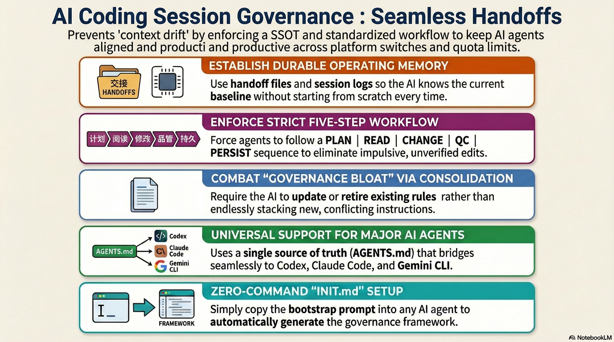

English | [繁體中文](README.zh-TW.md) | [简体中文](README.zh-CN.md) | [日本語](README.ja.md)

# :rocket: Governance Template for Cross-AI Handoff Workflows

If your Codex / Claude / Gemini hourly or weekly token quota runs out, this template lets the next AI continue from the same project state without re-briefing.

- Durable handoff across AI CLIs
- Standard workflow: `PLAN -> READ -> CHANGE -> QC -> PERSIST`
- Built-in anti-drift governance (not just more rules)

**[30-second Quick Start](#quickstart)** · **[Install](#install)** · **[Quick Operations](#quick-operations)**



---

## :bookmark_tabs: Why this exists

Most multi-agent projects fail in handoff, not generation quality.

Common failure pattern:
- Session context resets every handoff
- Patch-on-patch fixes make rules noisier
- README, handoff, and logs drift apart

This template enforces:
1. One re-entry path every session
2. One operating workflow every task
3. One persistent record before session close

---

## :bookmark_tabs: Built-in safeguards

Beyond session handoff, the template enforces safeguards for recurring AI failure modes:

| Safeguard | What it prevents |
|---|---|
| **External API Code Safety** | Writing API-calling code from hallucinated endpoint / schema memory; requires doc-verified baseline before coding |
| **Codebase context snapshot** | Relearning tech stack, external services, and key decisions from scratch every session |
| **Test plan governance** | Merging changes without a scenario matrix — expected vs. actual outcomes untracked |
| **Consolidation discipline** | Rule accumulation without checking whether existing rules should be updated first |

---

<a id="quickstart"></a>

## :bookmark_tabs: 30-second Quick Start

1. Open **[INIT.md](INIT.md)** and paste it into your AI CLI.
2. Confirm root and write prompts exactly:
   - `INSTALL_ROOT_OK: <absolute_path>`
   - `INSTALL_WRITE_OK`
3. Start each new session with:

```text
Follow AGENTS.md
```

---

<a id="install"></a>

## :bookmark_tabs: Install

1. Open **[INIT.md](INIT.md)** -> click **Raw** -> copy all
2. Paste into Codex, Claude Code, or Gemini CLI
3. AI runs root safety preflight and prints in order: `pwd`, then `git root`
4. If `pwd` and `git root` differ, AI must stop and let you choose root (no auto-select)
5. AI prints risk checks and dry-run plan (`create` / `merge` / `skip`) before writing
6. You confirm:
   - `INSTALL_ROOT_OK: <absolute_path>`
   - `INSTALL_WRITE_OK`
7. Before first write, AI creates a lightweight backup snapshot at `<PROJECT_ROOT>/dev/init_backup/<UTC_TIMESTAMP>/` for existing target governance files
8. AI creates/merges 5 governance files in the confirmed project root
9. AI prints a **Quick Start** block with copy-paste commands — no need to memorize session commands

### :small_blue_diamond: Install UI walkthrough

<table>
  <tr>
    <td align="center" width="50%">
      
      <br />
      <sub>Step 1: Paste `INIT.md` into your AI CLI</sub>
    </td>
    <td align="center" width="50%">
      
      <br />
      <sub>Step 2: Review detected roots</sub>
    </td>
  </tr>
  <tr>
    <td align="center" width="50%">
      
      <br />
      <sub>Step 3: Confirm `INSTALL_ROOT_OK`</sub>
    </td>
    <td align="center" width="50%">
      
      <br />
      <sub>Step 4: Confirm `INSTALL_WRITE_OK`</sub>
    </td>
  </tr>
</table>

After step 4 confirmation, AI automatically creates the backup snapshot before the first file write.

### :small_blue_diamond: Real run snapshots

<table>
  <tr>
    <td align="center" width="50%">
      
      <br />
      <sub>Launch: session boot and context loading</sub>
    </td>
    <td align="center" width="50%">
      
      <br />
      <sub>Closeout: session summary and handoff output</sub>
    </td>
  </tr>
</table>

Do not copy this repository manually into another project root. Use `INIT.md` so merge behavior stays safe and deterministic.

---

## :bookmark_tabs: Quick Operations

### :small_blue_diamond: 1) Start a session

```text
Follow AGENTS.md
```

### :small_blue_diamond: 2) Close with full handoff

```text
Wrap up this session with full closeout and handover.
```

### :small_blue_diamond: 3) Resume in another AI CLI

```text
<Paste the previous "NEXT SESSION HANDOFF PROMPT (COPY/PASTE)" block here, unchanged.>
```

---

## :bookmark_tabs: Quota-switch handoff flow

1. Work in CLI-A until quota is near limit
2. Ask for closeout and copy the generated handoff block
3. Open CLI-B and paste the block unchanged
4. CLI-B continues from the same baseline using `SESSION_HANDOFF.md` + `SESSION_LOG.md`

This is the primary design target of this repo.

---

## :bookmark_tabs: Platform setup

`AGENTS.md` is the SSOT. `CLAUDE.md` and `GEMINI.md` are thin pointers.

| Platform | Native file | What ships | Existing file action |
|---|---|---|---|
| **Codex** | `AGENTS.md` | full governance rules | merge governance sections |
| **Claude Code** | `CLAUDE.md` | pointer: `@AGENTS.md` | prepend `@AGENTS.md` |
| **Gemini CLI** | `GEMINI.md` | pointer: `@./AGENTS.md` | prepend `@./AGENTS.md` |

---

## :bookmark_tabs: 3 scenarios

### :small_blue_diamond: Scenario 1 — Quota exhausted, switch AI and continue
You hit quota in one CLI and must switch immediately.  
This template preserves baseline, pending tasks, risks, and validation state so work continues without re-explaining context.

### :small_blue_diamond: Scenario 2 — One repo, multiple AI agents
Different agents handle code, docs, and infra.  
Shared handoff/log discipline prevents parallel reality drift.

### :small_blue_diamond: Scenario 3 — Long-lived repo with governance drift
Fixes keep accumulating and docs diverge.  
Consolidation-before-adding rules reduce SOP sprawl and maintenance cost.

---

## :bookmark_tabs: FAQ

### :small_blue_diamond: 1) Is this only for large projects?
No. Small repos benefit immediately from continuity; large repos benefit more over time.

### :small_blue_diamond: 2) Do I need `PROJECT_MASTER_SPEC.md` on day one?
No. Start with `AGENTS.md` + `SESSION_HANDOFF.md` + `SESSION_LOG.md`.

### :small_blue_diamond: 3) Is this a coding style guide?
No. It is a governance model for how AI reads, changes, verifies, and hands over work.

### :small_blue_diamond: 4) Will this slow sessions down?
Slightly at session start, usually far less than repeated re-briefing and duplicate fixes.

### :small_blue_diamond: 5) Can I keep my existing docs and internal rules?
Yes. This template is designed to merge into existing project material, not replace it blindly.

---

## :bookmark_tabs: Repository source layout

```text
<PROJECT_ROOT>/
├─ INIT.md
├─ AGENTS.md
├─ CLAUDE.md
├─ GEMINI.md
└─ dev/
   ├─ SESSION_HANDOFF.md
   ├─ SESSION_LOG.md
   ├─ CODEBASE_CONTEXT.md      # auto-generated first session
   └─ PROJECT_MASTER_SPEC.md   # optional
```

### :small_blue_diamond: Core files

- `INIT.md` - bootstrap prompt (public entry point)
- `AGENTS.md` - governance SSOT
- `CLAUDE.md` - Claude pointer to SSOT
- `GEMINI.md` - Gemini pointer to SSOT
- `dev/SESSION_HANDOFF.md` - current baseline and next priorities
- `dev/SESSION_LOG.md` - session-by-session history and validation
- `dev/CODEBASE_CONTEXT.md` - tech stack, external services, key decisions (auto-generated first session)
- `dev/PROJECT_MASTER_SPEC.md` - optional long-term authority

---

## :bookmark_tabs: Governance principles

1. Read before change
2. Triage before debug
3. Consolidate before adding
4. Verify before claiming done
5. Persist before leaving

---

## :bookmark_tabs: Verification

Detailed claim mapping and platform validation are maintained in:
- [docs/VERIFICATION.md](docs/VERIFICATION.md)
- Latest QA regression report: [docs/qa/LATEST.md](docs/qa/LATEST.md)

Snapshot status (as of 2026-03-16):
- AGENTS/INIT rule parity: verified (51-check regression suite)
- Multi-platform pointer behavior: verified
- Longitudinal 50+ session durability: not yet verified

---

## :bookmark_tabs: Deep docs

If this repo grows, recommended companion docs:
- `dev/PROJECT_MASTER_SPEC.md`
- `docs/OPERATIONS.md`
- `docs/POSITIONING.md`

Current minimum:
- `AGENTS.md`
- `dev/SESSION_HANDOFF.md`
- `dev/SESSION_LOG.md`

---

## :bookmark_tabs: License

Use, adapt, and extend for your workflows.
