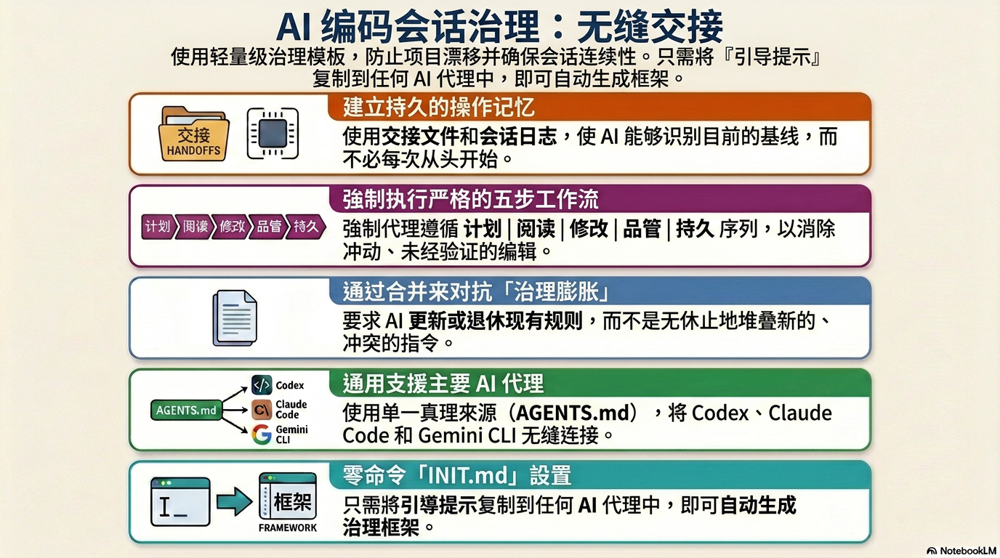
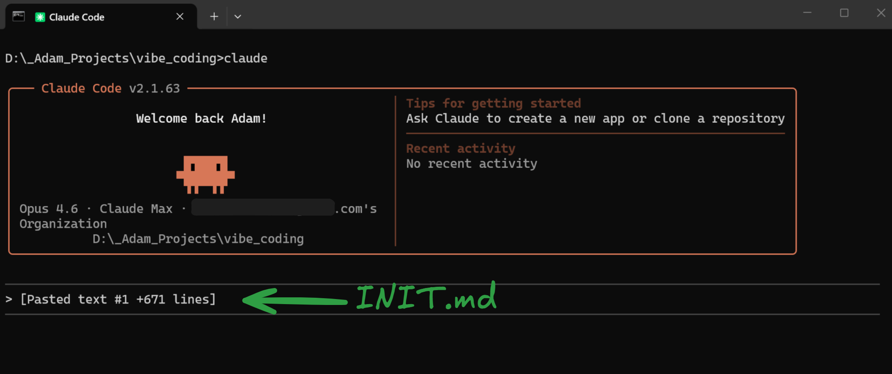
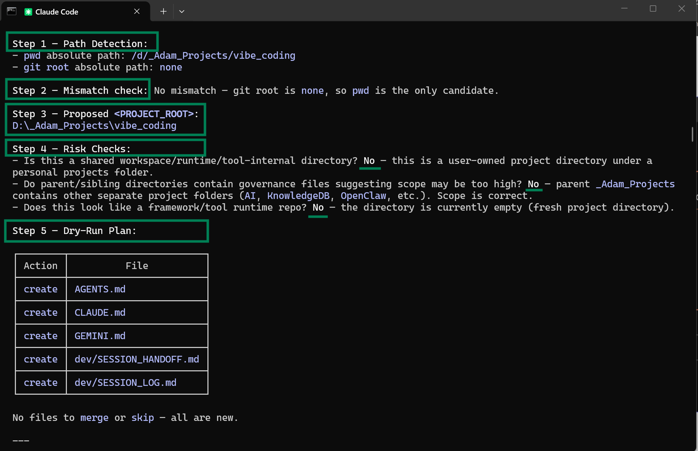
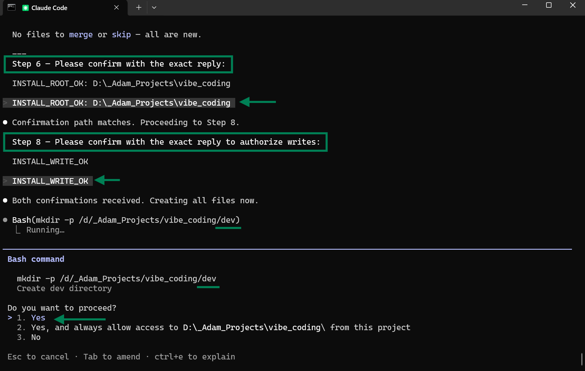
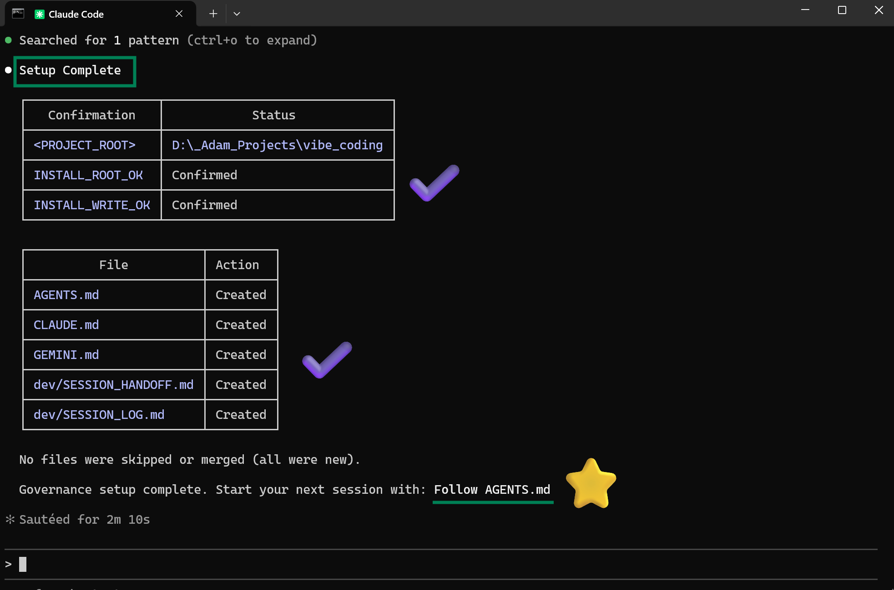
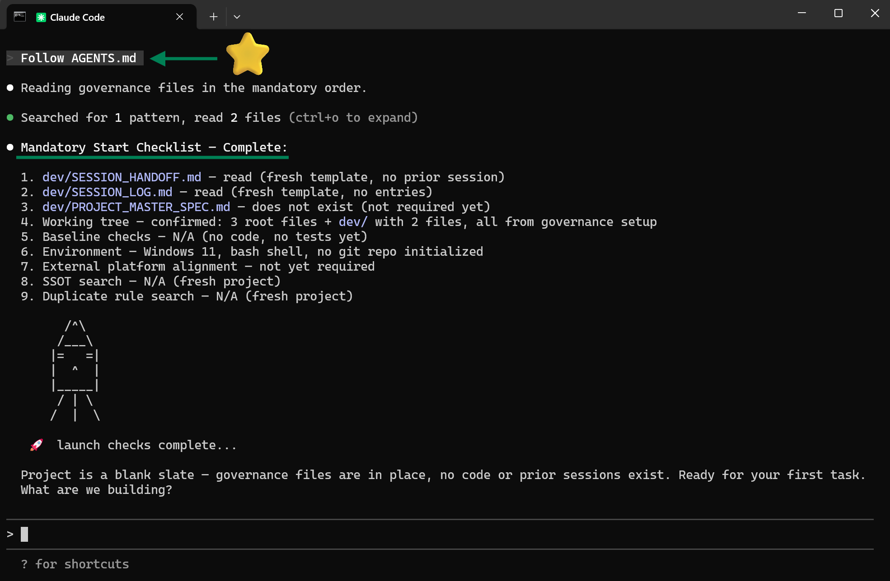
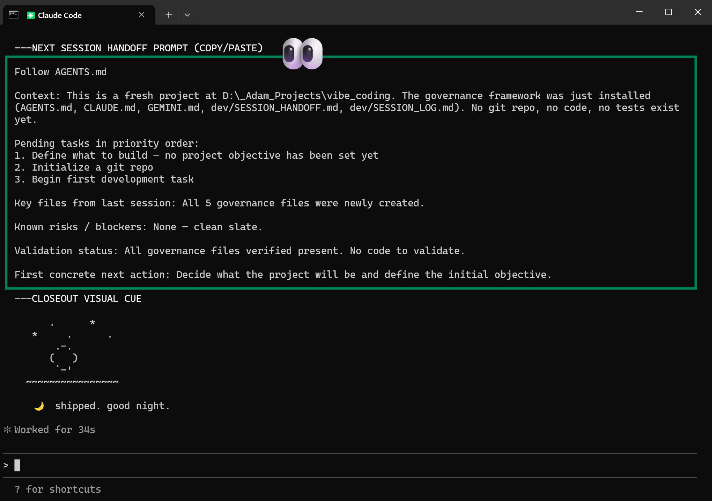

[English](README.md) | [繁體中文](README.zh-TW.md) | 简体中文 | [日本語](README.ja.md)

# :rocket: 支持跨 AI 工具交接的开发治理模板

当你在 Codex、Claude 或 Gemini 的每小时或每周令牌配额用尽时，本模板可让下一个 AI 工具直接承接同一项目状态，无须重新交代背景。

- 支持跨命令行工具的持久交接
- 统一工作流程：`PLAN -> READ -> CHANGE -> QC -> PERSIST`
- 内建防漂移治理机制（而非仅持续新增规则）

**[30 秒快速开始](#quickstart)** · **[安装](#install)** · **[快速操作](#quick-operations)**



---

## :bookmark_tabs: 为什么要做这个

在多 AI 工具协作的开发场景中，最常失效的通常不是模型生成能力，而是交接流程。

常见失败模式如下：
- 每次切换工具都要从零开始
- 修复持续叠加在旧修复之上
- 说明文档、交接文档与工作日志逐步失去一致性

本模板通过规则确保以下三件事：
1. 每个工作阶段只有一条重入路径
2. 每项任务遵循同一套工作流程
3. 每次收尾都会落地为可追溯的持久化记录

---

<a id="quickstart"></a>

## :bookmark_tabs: 30 秒快速开始

1. 打开 **[INIT.md](INIT.md)**，并粘贴到你的 AI 命令行工具中。
2. 按提示精确回复：
   - `INSTALL_ROOT_OK: <absolute_path>`
   - `INSTALL_WRITE_OK`
3. 之后每次新工作阶段开始时，输入：

```text
请按 AGENTS.md 开始本次工作阶段
```

---

<a id="install"></a>

## :bookmark_tabs: 安装

1. 打开 **[INIT.md](INIT.md)** -> 点击 **Raw** -> 全选 -> 复制
2. 粘贴到你的 AI 命令行工具（Claude Code、Codex、Gemini CLI 均可）
3. AI 会先执行根目录安全预检，并按顺序显示路径：`pwd`、`git root`
4. 若 `pwd` 与 `git root` 不一致，AI 必须先停止，并要求你选择根目录（1：使用 `pwd`，2：使用 `git root`）；AI 不可自行决定
5. AI 会针对你选择的根目录显示风险检查与演练规划（`create` / `merge` / `skip`），此时仍不会写入文件
6. 出现提示后，请回复以下确认句：
   - `INSTALL_ROOT_OK: <absolute_path>`
   - `INSTALL_WRITE_OK`
7. 在首次写入前，AI 会在 `<PROJECT_ROOT>/dev/init_backup/<UTC_TIMESTAMP>/` 自动创建轻量备份快照，保存已有治理目标文件
8. AI 会在你确认的项目根目录中创建或合并 5 个治理文件

### :small_blue_diamond: 安装流程界面

<table>
  <tr>
    <td align="center" width="50%">
      
      <br />
      <sub>步骤 1：将 `INIT.md` 粘贴到 AI 命令行工具</sub>
    </td>
    <td align="center" width="50%">
      
      <br />
      <sub>步骤 2：确认检测到的根目录</sub>
    </td>
  </tr>
  <tr>
    <td align="center" width="50%">
      
      <br />
      <sub>步骤 3：回复 `INSTALL_ROOT_OK`</sub>
    </td>
    <td align="center" width="50%">
      
      <br />
      <sub>步骤 4：回复 `INSTALL_WRITE_OK`</sub>
    </td>
  </tr>
</table>

完成步骤 4 的确认后，AI 会先自动创建备份快照，再进行首次写入。

### :small_blue_diamond: 实际执行界面

<table>
  <tr>
    <td align="center" width="50%">
      
      <br />
      <sub>启动：工作阶段开机与上下文加载</sub>
    </td>
    <td align="center" width="50%">
      
      <br />
      <sub>收尾：工作阶段摘要与交接输出</sub>
    </td>
  </tr>
</table>

你无须手动设置。AI 会自动处理整个流程，并智能合并已有 `AGENTS.md`、`CLAUDE.md`、`GEMINI.md` 内容。
对多数公开用户而言，直接使用 `INIT.md` 即可。
请勿手动将整个仓库复制到项目根目录；请使用 `INIT.md` 以确保合并流程安全且可预期。

---

<a id="quick-operations"></a>

## :bookmark_tabs: 快速操作

可使用自然语言。以下句子可直接复制粘贴。

### :small_blue_diamond: 1) 开始新工作阶段

```text
请按 AGENTS.md 开始本次工作阶段
```

### :small_blue_diamond: 2) 在同一工作阶段持续推进

```text
请按当前状态继续，并按 PLAN -> READ -> CHANGE -> QC -> PERSIST 推进。
```

### :small_blue_diamond: 3) 收尾并完成完整交接

```text
请为本次工作阶段完成收尾与完整交接。
```

### :small_blue_diamond: 4) 快速开始下一个工作阶段

```text
<请粘贴上一轮输出的“NEXT SESSION HANDOFF PROMPT (COPY/PASTE)”区块（保持原文）。>
```

---

## :bookmark_tabs: 配额切换交接流程

1. 在命令行工具 A 的配额即将耗尽前，先完成本次收尾
2. 复制 `NEXT SESSION HANDOFF PROMPT (COPY/PASTE)` 区块
3. 在命令行工具 B 原文粘贴，不要改动内容
4. 工具 B 会依据 `SESSION_HANDOFF.md` 与 `SESSION_LOG.md` 接续执行

这是本仓库的核心设计目标。

---

## :bookmark_tabs: 平台设置

`AGENTS.md` 为单一真实来源（SSOT）；`CLAUDE.md` 与 `GEMINI.md` 为薄型指针文件。

| 平台 | 原生文件 | 预设提供 | 若你已有该文件 |
|---|---|---|---|
| **Codex** | `AGENTS.md` | `AGENTS.md`（完整规则） | 将治理章节合并到已有文件 |
| **Claude Code** | `CLAUDE.md` | 指针文件：`@AGENTS.md` | 在已有 `CLAUDE.md` **最上方**加入 `@AGENTS.md` |
| **Gemini CLI** | `GEMINI.md` | 指针文件：`@./AGENTS.md` | 在已有 `GEMINI.md` **最上方**加入 `@./AGENTS.md` |

---

## :bookmark_tabs: 3 种场景

### :small_blue_diamond: 场景 1 — 一个 AI 工具用尽配额，切换另一个工具续做
当你在某个命令行工具用尽配额时，可能需要立即切换到另一个工具。  
本模板可保留基线、待办、风险与验证状态，避免重述上下文。

### :small_blue_diamond: 场景 2 — 一个仓库，多个 AI 工具协作
例如由 Codex 编写代码、Claude 处理文档、Gemini 协助调试基础设施。  
通过共用交接文档与工作日志，可避免各工具对项目状态产生分歧。

### :small_blue_diamond: 场景 3 — 长期项目治理开始漂移
修复逐步累积、规则持续扩张、文档彼此矛盾。  
“先整合、后新增”可降低 SOP 膨胀与长期维护成本。

---

## :bookmark_tabs: 常见问题

### :small_blue_diamond: 1) 这只适合大型项目吗？
不是。小型项目可立即受益于交接连续性；大型项目的长期效益通常更明显。

### :small_blue_diamond: 2) 第一天就需要 `PROJECT_MASTER_SPEC.md` 吗？
不一定。先使用 `AGENTS.md` + `SESSION_HANDOFF.md` + `SESSION_LOG.md` 即可。

### :small_blue_diamond: 3) 这是编码标准吗？
不是。它是 AI 在仓库内运作的治理标准，规范如何阅读、修改、验证与交接。

### :small_blue_diamond: 4) 这会拖慢 AI 吗？
每次工作阶段开始时会增加少量前置读取时间，但通常远低于重复交代与返工造成的整体成本。

### :small_blue_diamond: 5) 我已经有 README、既有文档与内部规则，仍然适用吗？
适用，而且建议保留既有内容。本模板的设计目标是整合，而非覆盖。

---

## :bookmark_tabs: 此仓库原始布局

```text
<PROJECT_ROOT>/
├─ INIT.md
├─ AGENTS.md
├─ CLAUDE.md
├─ GEMINI.md
└─ dev/
   ├─ SESSION_HANDOFF.md
   ├─ SESSION_LOG.md
   └─ PROJECT_MASTER_SPEC.md   # 可选
```

### :small_blue_diamond: 核心文件

- `INIT.md` - 创建/合并治理文件的启动提示（公开入口）
- `AGENTS.md` - 治理单一真实来源（SSOT）
- `CLAUDE.md` - Claude 指针文件
- `GEMINI.md` - Gemini 指针文件
- `dev/SESSION_HANDOFF.md` - 当前基线与下一步优先事项
- `dev/SESSION_LOG.md` - 逐工作阶段历史与验证结果
- `dev/PROJECT_MASTER_SPEC.md` - 可选的长期权威规格

---

## :bookmark_tabs: 本模板背后的治理原则

1. 修改前先阅读
2. 调试前先分类
3. 新增前先整合
4. 宣称完成前先验证
5. 离开前先持久化

---

## :bookmark_tabs: 验证记录

完整声明对照与平台验证请见：
- [docs/VERIFICATION.md](docs/VERIFICATION.md)
- 最新 QA 回归验收报告： [docs/qa/LATEST.md](docs/qa/LATEST.md)

截至 2026-02-27 的摘要如下：
- AGENTS/INIT 规则同步：已验证
- 多平台指针文件行为：已验证
- 50+ 工作阶段的长期纵向效果：尚未验证

---

## :bookmark_tabs: 深度文档

若本仓库后续扩大，建议补充以下文档：

- `dev/PROJECT_MASTER_SPEC.md` — 完整架构、工作流程、发布、操作手册权威
- `docs/OPERATIONS.md` — 面向操作者的使用与维护程序
- `docs/POSITIONING.md` — 本模板的用途、非用途与定位

若上述文件尚不存在，当前最小需求仍为：

- `AGENTS.md`
- `dev/SESSION_HANDOFF.md`
- `dev/SESSION_LOG.md`

---

## :bookmark_tabs: 许可

可自由使用、改编与扩展到你的工作流程中。
若你有改进，欢迎回馈可降低漂移且不增加复杂度的做法。
