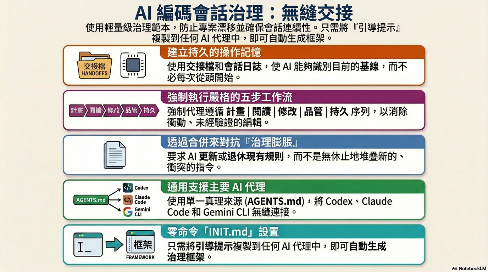

[English](README.md) | 繁體中文 | [简体中文](README.zh-CN.md) | [日本語](README.ja.md)

# :rocket: 當一個 AI 工具配額用盡時，立即切換並延續開發

當你在 Codex、Claude 或 Gemini 的每小時或每週權杖配額用盡時，本範本可讓下一個 AI 工具直接承接同一個專案狀態，無須重新交代背景。

- 支援跨命令列工具的持久交接
- 統一工作流程：`PLAN -> READ -> CHANGE -> QC -> PERSIST`
- 內建防漂移治理機制（而非僅持續新增規則）

**[30 秒快速開始](#quickstart)** · **[安裝](#install)** · **[快速操作](#quick-operations)**



---

## :bookmark_tabs: 為什麼要做這個

在多 AI 工具協作的開發情境中，最常失效的通常不是模型生成能力，而是交接流程。

常見失敗模式如下：
- 每次切換工具都要從零開始
- 修復持續疊加在舊修復之上
- 說明文件、交接文件與工作日誌逐步失去一致性

本範本透過規範確保以下三件事：
1. 每個工作階段只有一條重入路徑
2. 每項任務遵循同一套工作流程
3. 每次收尾都會落地為可追溯的持久化紀錄

---

<a id="quickstart"></a>

## :bookmark_tabs: 30 秒快速開始

1. 開啟 **[INIT.md](INIT.md)**，並貼到你的 AI 命令列工具中。
2. 依提示精確回覆：
   - `INSTALL_ROOT_OK: <absolute_path>`
   - `INSTALL_WRITE_OK`
3. 之後每次新工作階段開始時，輸入：

```text
請依 AGENTS.md 開始本次工作階段
```

---

<a id="install"></a>

## :bookmark_tabs: 安裝

1. 開啟 **[INIT.md](INIT.md)** -> 點擊 **Raw** -> 全選 -> 複製
2. 貼到你的 AI 命令列工具（Claude Code、Codex、Gemini CLI 皆可）
3. AI 會先執行根目錄安全預檢，並依序顯示路徑：`pwd`、`git root`
4. 若 `pwd` 與 `git root` 不一致，AI 必須先停止，並要求你選擇根目錄（1：使用 `pwd`，2：使用 `git root`）；AI 不可自行決定
5. AI 會針對你選擇的根目錄顯示風險檢查與演練規劃（`create` / `merge` / `skip`），此時仍不會寫入檔案
6. 出現提示後，請回覆以下確認句：
   - `INSTALL_ROOT_OK: <absolute_path>`
   - `INSTALL_WRITE_OK`
7. AI 會在你確認的專案根目錄中建立或合併 5 個治理檔案

### :small_blue_diamond: 安裝流程畫面

<table>
  <tr>
    <td align="center" width="50%">
      
      <br />
      <sub>步驟 1：將 `INIT.md` 貼到 AI 命令列工具</sub>
    </td>
    <td align="center" width="50%">
      
      <br />
      <sub>步驟 2：確認偵測到的根目錄</sub>
    </td>
  </tr>
  <tr>
    <td align="center" width="50%">
      
      <br />
      <sub>步驟 3：回覆 `INSTALL_ROOT_OK`</sub>
    </td>
    <td align="center" width="50%">
      
      <br />
      <sub>步驟 4：回覆 `INSTALL_WRITE_OK`</sub>
    </td>
  </tr>
</table>

### :small_blue_diamond: 實際執行畫面

<table>
  <tr>
    <td align="center" width="50%">
      
      <br />
      <sub>啟動：工作階段開機與上下文載入</sub>
    </td>
    <td align="center" width="50%">
      
      <br />
      <sub>收尾：工作階段摘要與交接輸出</sub>
    </td>
  </tr>
</table>

你無須手動設定。AI 會自動處理整個流程，並智慧合併既有 `AGENTS.md`、`CLAUDE.md`、`GEMINI.md` 內容。
對多數公開使用者而言，直接使用 `INIT.md` 即可。
請勿手動將整個儲存庫複製到專案根目錄；請使用 `INIT.md` 以確保合併流程安全且可預期。

---

<a id="quick-operations"></a>

## :bookmark_tabs: 快速操作

可使用自然語言。以下句子可直接複製貼上。

### :small_blue_diamond: 1) 開始新工作階段

```text
請依 AGENTS.md 開始本次工作階段
```

### :small_blue_diamond: 2) 在同一工作階段持續推進

```text
請依目前狀態繼續，並依 PLAN -> READ -> CHANGE -> QC -> PERSIST 推進。
```

### :small_blue_diamond: 3) 收尾並完成完整交接

```text
請為本次工作階段完成收尾與完整交接。
```

### :small_blue_diamond: 4) 快速開始下一個工作階段

```text
<請貼上上一輪輸出的「NEXT SESSION HANDOFF PROMPT (COPY/PASTE)」區塊（原文不改）。>
```

---

## :bookmark_tabs: 配額切換交接流程

1. 在命令列工具 A 的配額即將耗盡前，先完成本次收尾
2. 複製 `NEXT SESSION HANDOFF PROMPT (COPY/PASTE)` 區塊
3. 在命令列工具 B 原文貼上，不要改動內容
4. 工具 B 會依 `SESSION_HANDOFF.md` 與 `SESSION_LOG.md` 接續執行

這是本儲存庫的核心設計目標。

---

## :bookmark_tabs: 平台設定

`AGENTS.md` 為單一真實來源（SSOT）；`CLAUDE.md` 與 `GEMINI.md` 為薄型指標檔。

| 平台 | 原生檔案 | 預設提供 | 若你已有該檔案 |
|---|---|---|---|
| **Codex** | `AGENTS.md` | `AGENTS.md`（完整規則） | 將治理章節合併到既有檔案 |
| **Claude Code** | `CLAUDE.md` | 指標檔：`@AGENTS.md` | 在既有 `CLAUDE.md` **最上方**加入 `@AGENTS.md` |
| **Gemini CLI** | `GEMINI.md` | 指標檔：`@./AGENTS.md` | 在既有 `GEMINI.md` **最上方**加入 `@./AGENTS.md` |

---

## :bookmark_tabs: 3 種情境

### :small_blue_diamond: 情境 1 — 一個 AI 工具用盡配額，切換另一個工具續做
當你在某個命令列工具用盡配額時，可能需要立即切換到另一個工具。  
本範本可保留基線、待辦、風險與驗證狀態，避免重述上下文。

### :small_blue_diamond: 情境 2 — 一個儲存庫，多個 AI 工具協作
例如由 Codex 撰寫程式碼、Claude 處理文件、Gemini 協助除錯基礎設施。  
透過共用交接文件與工作日誌，可避免各工具對專案狀態產生分歧。

### :small_blue_diamond: 情境 3 — 長期專案治理開始漂移
修復逐步累積、規則持續擴張、文件彼此矛盾。  
「先整合、後新增」可降低 SOP 膨脹與長期維護成本。

---

## :bookmark_tabs: 常見問題

### :small_blue_diamond: 1) 這只適合大型專案嗎？
不是。小型專案可立即受益於交接連續性；大型專案的長期效益通常更明顯。

### :small_blue_diamond: 2) 第一天就需要 `PROJECT_MASTER_SPEC.md` 嗎？
不一定。先使用 `AGENTS.md` + `SESSION_HANDOFF.md` + `SESSION_LOG.md` 即可。

### :small_blue_diamond: 3) 這是編碼標準嗎？
不是。它是 AI 在儲存庫內運作的治理標準，規範如何閱讀、修改、驗證與交接。

### :small_blue_diamond: 4) 這會拖慢 AI 嗎？
每次工作階段開始時會增加少量前置讀取時間，但通常遠低於重複交代與重工造成的整體成本。

### :small_blue_diamond: 5) 我已經有 README、既有文件與內部規則，仍然適用嗎？
適用，而且建議保留既有內容。本範本的設計目標是整合，而非覆蓋。

---

## :bookmark_tabs: 此儲存庫原始佈局

```text
<PROJECT_ROOT>/
├─ INIT.md
├─ AGENTS.md
├─ CLAUDE.md
├─ GEMINI.md
└─ dev/
   ├─ SESSION_HANDOFF.md
   ├─ SESSION_LOG.md
   └─ PROJECT_MASTER_SPEC.md   # 可選
```

### :small_blue_diamond: 核心檔案

- `INIT.md` - 建立/合併治理檔案的啟動提示（公開入口）
- `AGENTS.md` - 治理單一真實來源（SSOT）
- `CLAUDE.md` - Claude 指標檔
- `GEMINI.md` - Gemini 指標檔
- `dev/SESSION_HANDOFF.md` - 當前基線與下一步優先事項
- `dev/SESSION_LOG.md` - 逐工作階段歷史與驗證結果
- `dev/PROJECT_MASTER_SPEC.md` - 可選的長期權威規格

---

## :bookmark_tabs: 本範本背後的治理原則

1. 修改前先閱讀
2. 除錯前先分類
3. 新增前先整合
4. 宣稱完成前先驗證
5. 離開前先持久化

---

## :bookmark_tabs: 驗證紀錄

完整聲明對照與平台驗證請見：
- [docs/VERIFICATION.md](docs/VERIFICATION.md)

截至 2026-02-27 的摘要如下：
- AGENTS/INIT 規則同步：已驗證
- 多平台指標檔行為：已驗證
- 50+ 工作階段的長期縱向效果：尚未驗證

---

## :bookmark_tabs: 深度文件

若本儲存庫後續擴大，建議補充以下文件：

- `dev/PROJECT_MASTER_SPEC.md` — 完整架構、工作流程、發佈、操作手冊權威
- `docs/OPERATIONS.md` — 面向操作者的使用與維護程序
- `docs/POSITIONING.md` — 本範本的用途、非用途與定位

若上述檔案尚不存在，當前最小需求仍為：

- `AGENTS.md`
- `dev/SESSION_HANDOFF.md`
- `dev/SESSION_LOG.md`

---

## :bookmark_tabs: 授權

可自由使用、改編與擴展至你的工作流程中。
若你有改進，歡迎回饋可降低漂移且不增加複雜度的做法。
